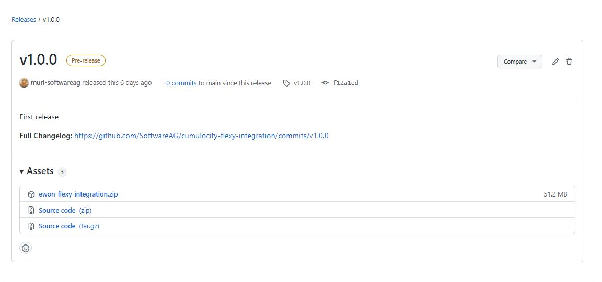
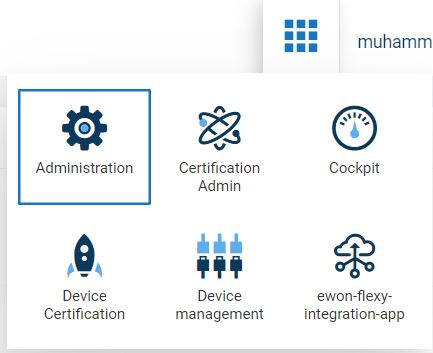
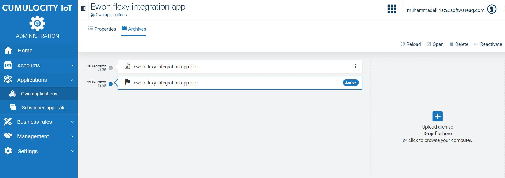

08/02/2022

# Deployment Guide
The Ewon Flexy Integration Application is comprised of following two components:

## Manual Deployment 
### Download latest release from GitHub
Download the latest release for both frontend & backend components from github links as mentioned below:

- Ewon Flexy Integration Application `(Frontend component)`
  - `https://github.com/SoftwareAG/cumulocity-flexy-integration-ui/releases`
  - Navigate to latest release version and download `ewon-flexy-integration-app.zip`
- Ewon Flexy Integration Microservice `(Backend component)`
  - `https://github.com/SoftwareAG/cumulocity-flexy-integration/releases`
  - Navigate to latest release version and download `ewon-flexy-integration.zip`

### Deploy on Cumulocity Tenant

- Login to Cumulocity tenant and navigate to `Administration` application.
  - 
- On the navigation menu, click on `Own application`.
- For first time deployment, click on `Add application` button.
  - 

#### Frontend Deployment

- When the `Add application` pop-up opens, click on `Upload web application`
  - 
  - Upload the downloaded release file `ewon-flexy-integration-app.zip` for frontend application.
  - Once uploaded the Ewon Flexy Integration App will start appearing on Own applications page, click on the `Open` button to view the application.

- __Alternatively__ if the application __already exists__, navigate to application page, click on `Archives`
  - 

- Set the currently uploaded file as active.
  - 

__Note:__ That the application takes a few minutes to startup.

#### Backend Deployment

- When the `Add application` pop-up opens, click on `Upload microservice`
  - 
  - Upload the downloaded release file `ewon-flexy-integration.zip` for frontend application.
  - Once uploaded the Ewon Flexy Integration microservice will start appearing on Own applications page.

- __Alternatively__ if the microservice __already exists__, navigate to application page, click on `Archives`
  - 

__Note:__ That the application takes a few minutes to startup.

## Automated Deployment (via Shell Script)
### Setup pre-requisites for shell script
### Running Script
