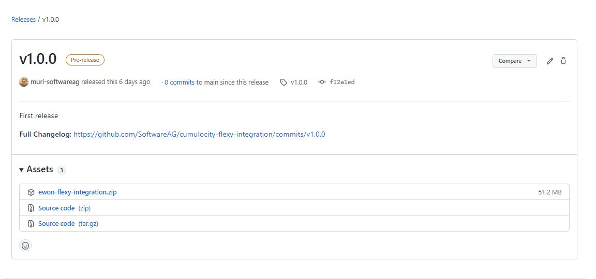
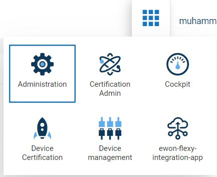
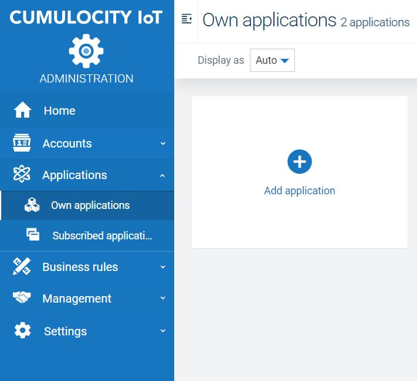
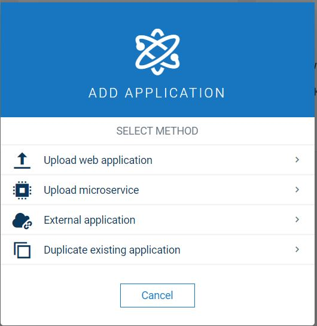
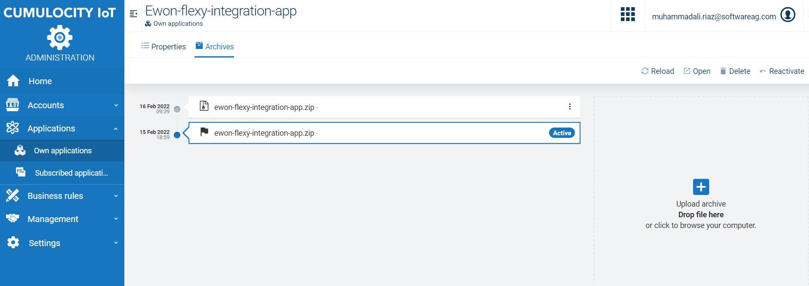
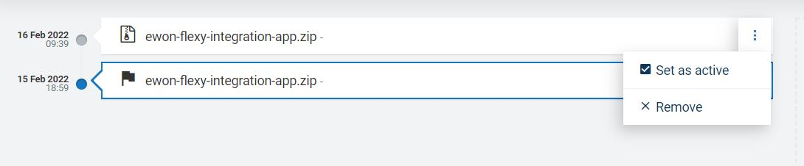
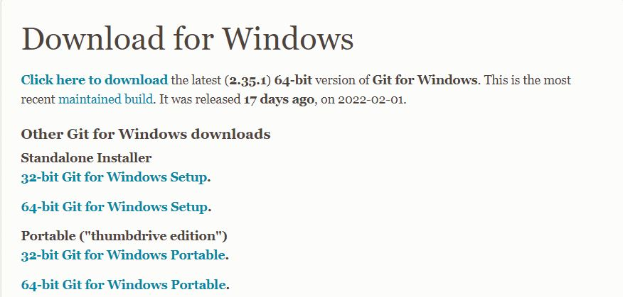
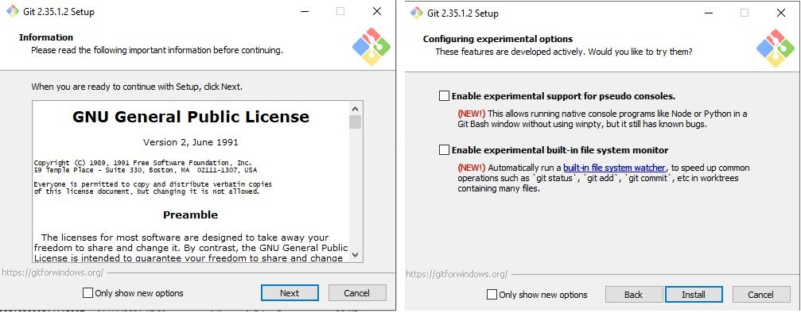
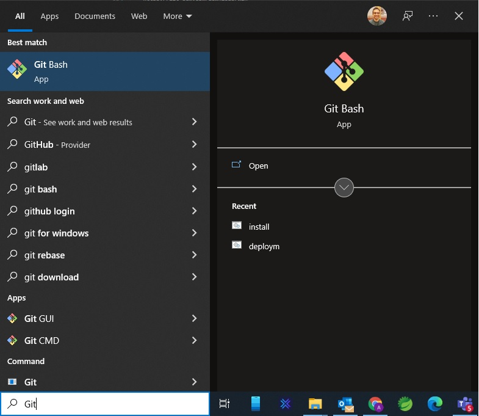
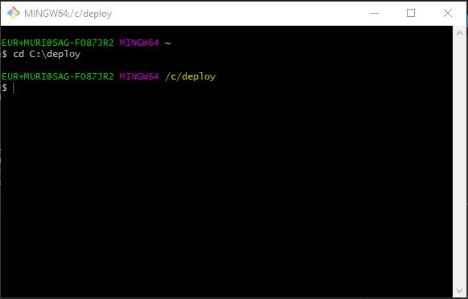

<p align="right">08/02/2022</p>

# Quick Start Guide - Flexy Registration

__What is the funcionality of the *Flexy Registration* tool?__
The tool *Flexy Registration* allows a quick and easly migration of Ewon Flexy devices from the cloud solution *Talk2M* by HMS Networks to Cumulocity IoT.

__Who can use the registration tool?__ 

Everyone who uses Ewon Flexy devices from *HMS Networks* and their cloud solution "Talk2M".

__Who can use the registration tool?__

Registration:
Talk2M Registered means that the device is stored in the Talk2M Platform and has an EWON Id. If not, then the device was created manually with the serial number.

Cumulocity registered means that the device has been registered and created on the tenant and has an externalID either ewonId or serial number and the device credentials have been created (we don't see here whether the device took it and is "really" connected).


## Description


## Usage

### Installing

### Folder structure

### Setup generic data
### Creating chapters

#### Insert a table

Use markdown table, and use the `Table: <Your table description>` syntax to add
a caption:

```md
| Index | Name |
| ----- | ---- |
| 0     | AAA  |
| 1     | BBB  |
| ...   | ...  |

Table: This is an example table.
```

If you want to reference a table, use LaTeX labels:

```md
Please, check Table /ref{example_table}.

| Index | Name |
| ----- | ---- |
| 0     | AAA  |
| 1     | BBB  |
| ...   | ...  |

Table: This is an example table.\label{example_table}
```

<p align="right">08/02/2022</p>

## Deployment Guide
The Ewon Flexy Integration Application is comprised of following two components:

### Manual Deployment for Ewon Flexy Integration Application


Download the latest release for both frontend & backend components from github links as mentioned below:

- Ewon Flexy Integration Application `(Frontend component)`
  - `https://github.com/SoftwareAG/cumulocity-flexy-integration-ui/releases`
  - Navigate to latest release version and download `ewon-flexy-integration-app.zip`
- Ewon Flexy Integration Microservice `(Backend component)`
  - `https://github.com/SoftwareAG/cumulocity-flexy-integration/releases`
  - Navigate to latest release version and download `ewon-flexy-integration.zip`



#### Deploy on Cumulocity Tenant


- Login to Cumulocity tenant and navigate to `Administration` application.
  - 
- On the navigation menu, click on `Own application`.
- For first time deployment, click on `Add application` button.

  - 


#### Frontend Deployment

- When the `Add application` pop-up opens, click on `Upload web application`
  - 
  - Upload the downloaded release file `ewon-flexy-integration-app.zip` for frontend application.
  - Once uploaded the Ewon Flexy Integration App will start appearing on Own applications page, click on the `Open` button to view the application.

- __Alternatively__ if the application __already exists__, navigate to application page, click on `Archives`
  - 

- Set the currently uploaded file as active.
  - 

__Note:__ That the application takes a few minutes to startup.


#### Backend Deployment

- When the `Add application` pop-up opens, click on `Upload microservice` (__NOTE:__ If this option is unavailable, this means, the tenant does not have permissions to host the microservice)
  - 
  - Upload the downloaded release file `ewon-flexy-integration.zip` for frontend application.
  - Once uploaded the Ewon Flexy Integration microservice will start appearing on Own applications page.

- __Alternatively__ if the microservice __already exists__, navigate to application page, click on `Archives`
  - 

__Note:__ That the application takes a few minutes to startup.

### Automated Deployment (via Bash Script)
#### Setup pre-requisites for bash script
The script 'Deployment.sh' was created in order to automate the entire deployment process for Ewon Flexy Integration Project. This section is comprised of instructions to successfully execute this script.

__Note__: This step can be ignored if Bash is already installed on your system.

Bash is a Unix shell and a command language. The Bash Script used for deploying the application is a collection of commands that automates the entire process of deployment with a small input from the user, like user name, password and Cumulocity tenant information. 

This instruction manual discusses installation of GitBash, but you are free to use any other Unix Shell.

#### Steps to download and install GitBash:
- Download Git from following url. Select either 32bit version or 64bit version depending on your system.
  - https://git-scm.com/download/win 
  - 
- Run the downloaded exe file, press `Next` with default configuration until the end. Press `Install` will install the GitBash on your system.
  - 
- To verify if GitBash has been installed on your system. Once the setup is finished, open `Start` menu and type Git Bash. You will see that GitBash has been installed correctly.
  - 

#### Running Script
Follow the following steps to run deployment script:
- Download the `deployment.sh` script
- Create a folder named `deploy` in `C drive` named 
- Open GitBash __(Run As Administrator)__ and navigate to directory where the script file is located
  - In GitBash, write `cd C:\deploy`, you will see the following change on GitBash terminal
  - 
- For Microservice deployment, use the following command:
  -  `sh deployment.sh deployms --baseurl <url-of-tenant> --tenant __<tenant-id-of-tenant>__ --user __<cumulocity-user>__ --password __<cumulocity-password>__`
-  For Frontend deployment, use the following commange:
     - `sh deployment.sh deployfe --baseurl <url-of-tenant> --tenant __<tenant-id-of-tenant>__ --user __<cumulocity-user>__ --password __<cumulocity-password>__`
-  Finally, you can log in to tenant and navigate to own application section and see the Microservice and the Frontend Application are both deployed.

